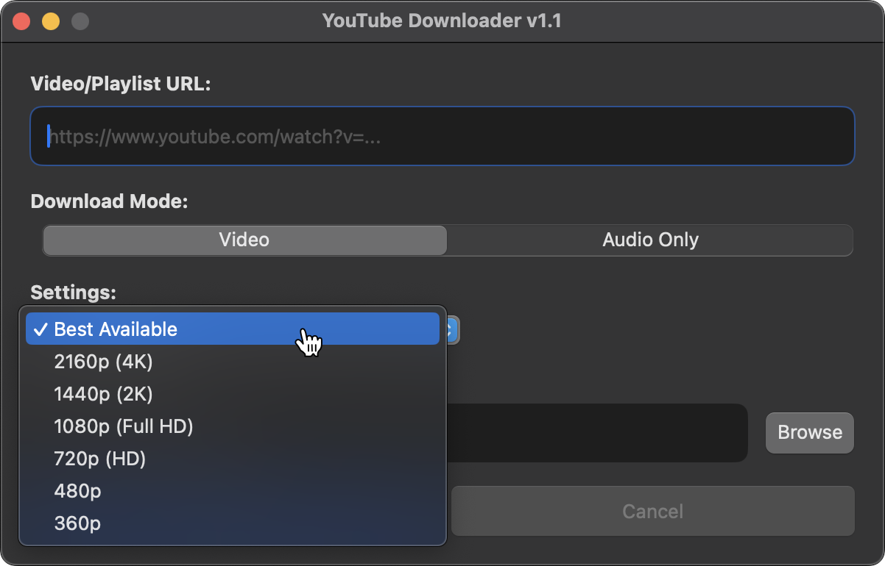
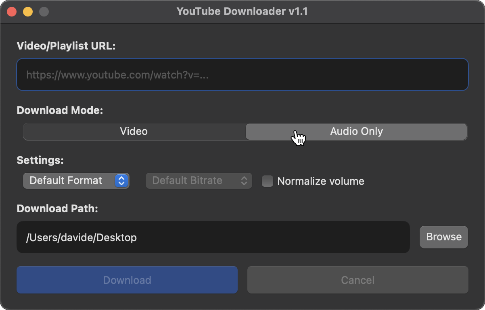

# YouTube Downloader for macOS

A simple native macOS app for downloading YouTube videos, playlists, and audio without using Terminal.

Under the hood, the app uses [`yt-dlp`](https://github.com/yt-dlp/yt-dlp) and `ffmpeg`, while giving you a straightforward graphical interface for the most common download options.

## Download

[**Download the latest version**](YouTube-Downloader-macOS-universal-v1-1.zip)

The app works on both **Apple Silicon and Intel Macs**.

## ☝️ Before you start

There are two things you may need to do before using the app for the first time.

### 1. Allow macOS to open the app

The app is signed, but it is not notarized through Apple's Developer Program. Because of this, macOS may block it after you download it.

If that happens:

1. Move **YouTube Downloader.app** to your `/Applications` folder.
2. Open Terminal.
3. Run this command once:

```bash
xattr -cr "/Applications/YouTube Downloader.app"
```

You should then be able to open the app normally.

### 2. Install `yt-dlp` and `ffmpeg`

YouTube Downloader uses two free command-line tools:

* `yt-dlp` handles the actual downloads.
* `ffmpeg` handles tasks such as converting audio, combining video and audio, embedding metadata, and normalization.

The app checks automatically whether both are installed. If either one is missing, it will tell you and temporarily disable downloading.

The easiest way to install them is with [Homebrew](https://brew.sh).

If you don't have Homebrew yet, install it with:

```bash
/bin/bash -c "$(curl -fsSL https://raw.githubusercontent.com/Homebrew/install/HEAD/install.sh)"
```

Then install both dependencies:

```bash
brew install yt-dlp ffmpeg
```

That's it. Restart the app and you're ready to go.

## Features

* Native macOS interface
* Download individual YouTube videos or entire playlists
* Choose video quality from the best available down to 360p
* Download audio only
* Save audio as MP3, M4A, or WAV
* Choose audio bitrate for compressed formats
* Optional audio normalization
* Embed metadata and thumbnails
* See download progress
* Cancel an active download
* Choose where downloaded files are saved
* Check for `yt-dlp` updates and install them directly from the app

## Preview

Choose video quality:



Download audio only:



## How to use it

1. Paste a YouTube video or playlist URL.
2. Choose **Video** or **Audio only**.
3. Select the quality or audio format you want.
4. Optionally enable audio normalization.
5. Choose where you want to save the files.
6. Start the download.

You can also cancel an active download at any time.

## Requirements

* macOS 14.6 or later
* `yt-dlp`
* `ffmpeg`

The app automatically checks whether `yt-dlp` and `ffmpeg` are available when it starts.

It also checks whether a newer version of `yt-dlp` is available and lets you update it directly from the app.

## Why I built it

I wanted a simple macOS interface for something I would otherwise have to do through Terminal with `yt-dlp`.

It started as a small personal utility and gradually grew as I tested it, fixed problems, and added the features I found useful.

## Development

The project was developed with AI assistance.

I defined the requirements, interface, and workflow, and used AI to help with implementation. I remained responsible for testing, debugging, validating, and refining the resulting application.

## A note about downloads

This project does not host or provide any media itself.

You are responsible for making sure that anything you download complies with applicable copyright laws, YouTube's terms, and any permissions attached to the content.

`yt-dlp` is an independent open-source project and is not maintained as part of this repository.

## Privacy

The repository does not contain downloaded media, personal application data, credentials, browser information, logs, or other machine-specific information.
